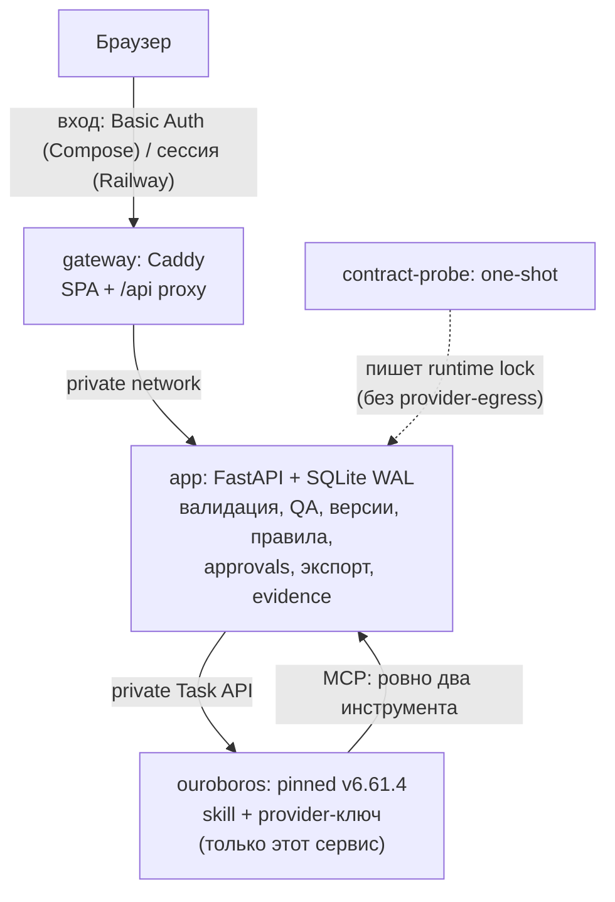

# Архитектура

## Карта сервисов и trust boundaries

Docker Compose поднимает три постоянных сервиса и один одноразовый probe. Наружу опубликован
единственный порт — loopback gateway (в hosted-профиле Railway та же связка работает внутри
одного сервиса за отдельной страницей входа с cookie-сессией — см. [Railway runbook](RAILWAY.md)).



- **gateway (Caddy)** — единственный published-порт `127.0.0.1:8080`; отдаёт React-сборку,
  проксирует `/api/v1/*`, подменяет actor-заголовки на аутентифицированную человеческую сессию.
  Внутренний MCP-endpoint и API Ouroboros он не проксирует никогда.
- **app (FastAPI)** — владеет брифами, versioned-контекстом, пакетами, QA, правилами,
  утверждениями, экспортом и safe-событиями в SQLite (WAL, busy timeout 5 с, foreign keys,
  `synchronous=NORMAL`). Не содержит provider-SDK и ключей; это проверяет архитектурный скан.
- **ouroboros** — закреплённый runtime `v6.61.4`
  (`a00d51dd414f794d830cacf7da760061e442fa88`). Единственный сервис с provider-ключом:
  read-only secret-mount читает entrypoint и экспортирует значение только внутри процесса.
- **contract-probe** — одноразовый сервис того же образа: без provider-egress перехватывает
  первый собранный provider-запрос, доказывает состав инструментов и активацию инструкции и
  атомарно пишет runtime lock, который app читает read-only перед каждой задачей.

## Поток одной генерации (две MCP-операции)

```text
готовый бриф → immutable ContextBundle (hash-версия)
→ управляемая задача Ouroboros (skill-инструкция в authoritative constraints)
→ mcp_factory__cf_context_get: одна выдача разрешённых фактов текущей версии
→ агент сам формирует typed DraftEnvelope (SMS + e-mail | patch | rule proposal)
→ mcp_factory__cf_draft_save: схема → ownership → grounding → 22-check QA → immutable-версия
→ ревью человека → approval → отдельный ZIP-экспорт
```

Успешная генерация содержит ровно две логические MCP-операции; transport-retry использует тот же
idempotency key и не создаёт второй черновик. Provider-запрос содержит только два prefixed
factory-инструмента: полный generated `disabled_tools` убирает все built-in, extension и прочие
MCP-схемы и на discovery-, и на execution-пути. Ревизия принимает только `CommunicationPatch`
(типизированный патч): авторитетный merge, проверку защищённых путей и полный QA выполняет
backend, а попытка изменить что-либо вне разрешённой области отклоняется без сохранения.

Одобренный владельцем адаптер `CF-RP-001` работает после штатного discovery/denylist: он
переводит ровно две factory-схемы в строгий режим провайдера (`strict=true`), доказывает
байтовое равенство всех остальных схем и останавливает запрос до провайдера при любом
несоответствии. Детали и процедура отката описаны в
[ADR 0001](adr/0001-strict-mcp-function-calling.md).

## Персистентность и evidence

Готовый бриф, контекст, версия пакета, QA-отчёт, замечание, diff, версия правила, утверждение и
экспорт — отдельные immutable-записи; критичное изменение инвалидирует текущие указатели, не
переписывая историю. Live-оценка и implementation evidence живут в отдельных checksummed
immutable-каталогах (`artifacts/evidence/`); человеческие submission-записи порождают производный
пакет и никогда не изменяют исходные артефакты. Резервная копия делается online Backup API
SQLite и включает БД, redacted runtime lock и валидные evidence-каталоги.

Для управляемого transport retry один `RunRow` остаётся логической operation/iteration, а
`RunAttemptRow` сохраняет каждую физическую task отдельно. Вторая запись допустима только после
`RELEASED` первой, положительной typed allowlist-классификации и проверки отсутствия draft/result;
уникальные ограничения и атомарный submission claim не дают двум reconcile-путям отправить одну
попытку дважды. История MCP authorization отдельно фиксирует task каждой попытки: вторая
authorization открывается лишь после закрытия первой. Logical ledger агрегирует обе попытки, но
сохраняет reason и `EXACT`/`UNKNOWN` usage каждой; API, diagnostics и export читают одну и ту же
durable запись.

## Поведение при сбоях

- Недоступность Ouroboros/MCP/провайдера → управляемый терминальный исход в пределах дедлайна
  профиля (канонический Compose — до 30 секунд; hosted-профиль Railway использует увеличенные
  тайм-ауты живой генерации — см. [Railway runbook](RAILWAY.md));
  зависших состояний нет, startup-reconciler добивает stale-прогоны до честного терминала.
- При включённом `CONTROLLED_PROVIDER_RETRY_ENABLED` только connect/read/write/pool timeout,
  connection reset, HTTP 408/429/500/502/503/504, закрытый набор normalized provider reasons или
  terminal deadline после подтверждённой отмены/release могут создать ровно одну вторую task.
  Неоднозначный submit сначала восстанавливается по client-generated `task_id`; неподтверждённый
  release завершает run fail-closed без второй task. Флаг во всех release-профилях выключен.
- Deterministic-fallback (шаблон без LLM) стартует только после подтверждённого терминала задачи
  и освобождения worker, всегда помечен `deterministic_template` и не считается live-результатом;
  поздний ответ задачи не может заменить уже терминальный fallback. Если live-результат уже
  сохранён, последующий accounting failure сохраняет его как failed/non-evidence и не запускает
  второй deterministic-fallback поверх той же версии контекста.
- Schema/QA-отказ — терминальный видимый результат: скрытых повторных генераций, ремонтных
  LLM-проходов и параллельного запуска агента с fallback нет.
- Повторный клик/запрос с тем же idempotency key возвращает исходную операцию; blocker делает
  утверждение технически невозможным.
- Расхождение текущих hash-ей runtime/skill/инструментов с lock блокирует генерацию до повторного
  `make bootstrap` (fail-closed).

Границы безопасности и модель угроз — в [Security](SECURITY.md); операционные команды — в
[Runbook](RUNBOOK.md).
